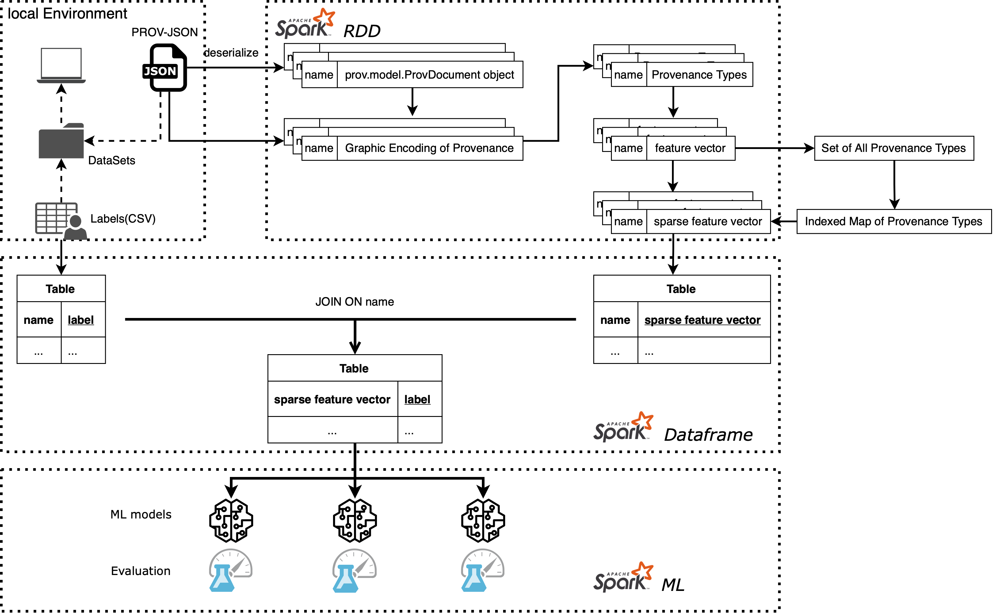

# k1924221_cui_yeshuai_code
This repository provides the source code for individual project "Processing and classification of provenance on Apache Spark"

## Dataset
The first step is to collect the dataset. Datasets are available at the Github repository Provenance Kernel Evaluation by Dong Huynh. Link is https://github.com/trungdong/provenance-kernel-evaluation/tree/master/datasets. 
Please note all the datasets in the repository are labelled datasets, and OpenProvenance public files need to be downloaded manually; this will be introduced later.
## Environment Setup
This section will introduce setting up a simple local environment to run the pipeline. 
To start with, please make sure your device has Java 9/11 and Python 3.6+. 
To run the pipeline, three components are required: Jupyter Notebook, prov and Apache Spark. 
And they are installed using PyPI. Once Python is available on your device. 
Please enter the following command in your terminal/command line:
```bash
python -m pip install prov pyspark notebook
```
Advanced installation options for Jupyter Notebook and Spark can be found at https://jupyter.org/install and https://spark.apache.org/docs/latest/index.html. 
A detailed guide on how to run Jupyter Notebook is available at https://jupyter-notebook-beginner-guide.readthedocs.io/en/latest/execute.html
Because the pipeline is organized in Jupyter Notebook, it is straightforward to run it.
## Other Information
It is strongly suggested that functions.py and all notebooks such as pipeline.ipynb are placed at the same level of the same directory. 
The file functions.py serves as a module and is imported into many notebooks. 
Running the notebook rest.ipynb will download the public files from OpenProvenance Storage and place them into openprov subdirectory in the current working directory. 
Paths to the datasets need to be filled before the pipeline is running.